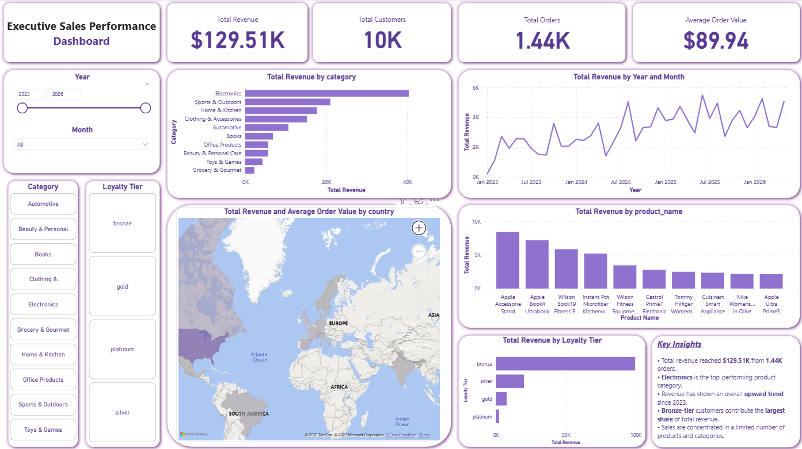
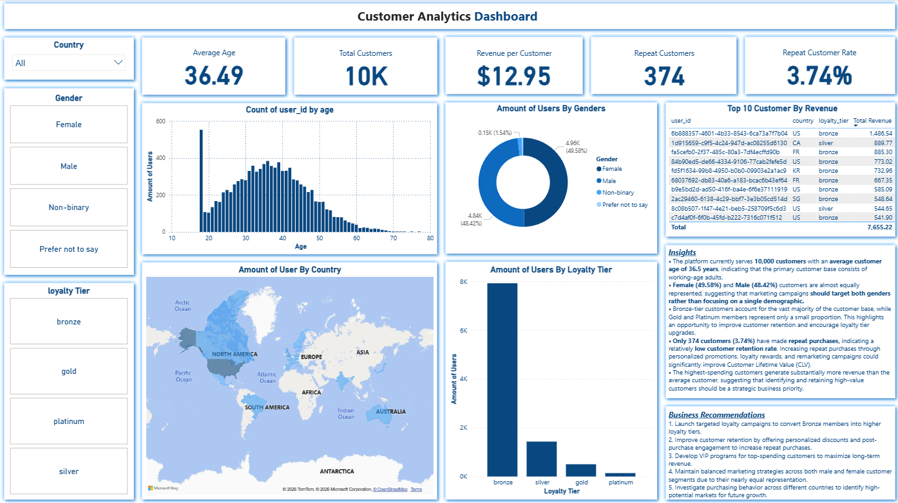
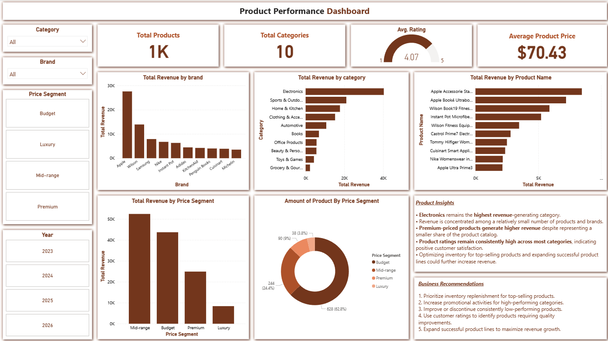

# 🛒 E-Commerce Product Intelligence Dashboard

An end-to-end Data Analytics project that transforms raw e-commerce data into actionable business insights using **Python, PostgreSQL, SQL, and Power BI**.

This project demonstrates the complete analytics workflow, including data validation, data preparation, SQL analysis, exploratory data analysis (EDA), and interactive dashboard development.

---

# 📌 Business Objective

The objective of this project is to analyze e-commerce sales performance and customer behavior to support data-driven business decisions.

The project aims to answer key business questions such as:

- How is the overall business performing?
- Which product categories generate the highest revenue?
- Who are the most valuable customers?
- How effective is the loyalty program?
- Which products and brands should the company prioritize?

---

# 🛠 Tech Stack

| Tool | Purpose |
|------|----------|
| Python | Data Cleaning & EDA |
| Pandas | Data Manipulation |
| PostgreSQL | Relational Database |
| SQL | Business Analysis |
| Power BI | Dashboard & Visualization |
| Jupyter Notebook | Data Exploration |
| Git & GitHub | Version Control |

---

# 📂 Project Structure

```
E-COMMERCE_PRODUCT_INTELLIGENCE/
│
├── data/
│   ├── interactions.csv
│   ├── products.csv
│   ├── purchases.csv
│   ├── reviews.csv
│   ├── sales_analytics.csv
│   ├── sessions.csv
│   └── users.csv
│
├── docs/
│   ├── Business_Objective.md
│   ├── data_dict.xlsx
│   └── diagram.pdf
│
├── notebook/
│   ├── 01_data_understanding.ipynb
│   └── 03_eda.ipynb
│
├── src/
│   ├── analytics/
│   │   ├── 03_business_kpi.sql
│   │   ├── 04_customer_analytics.sql
│   │   ├── 05_product_analytics.sql
│   │   └── 06_funnel_analysis.sql
│   │
│   ├── data_preparation/
│   │   ├── 01_database_validation.sql
│   │   ├── 02_data_preparation.ipynb
│   │   └── 02_data_quality_check.sql
│   │
│   └── database/
│       └── 07_views.sql
│
├── dashboard/
│   └── ecommerce_dashboard.pbix
│
├── images/
│   ├── executive_dashboard.png
│   ├── customer_dashboard.png
│   └── product_dashboard.png
│
├── .gitignore
└── README.md
```

---

# 📊 Data Pipeline

```
                 CSV Files
                     │
                     ▼
           Data Validation (SQL)
                     │
                     ▼
          Data Quality Check (SQL)
                     │
                     ▼
       Data Preparation (Python/Pandas)
                     │
                     ▼
          PostgreSQL Relational Database
                     │
                     ▼
             SQL Business Analytics
                     │
                     ▼
       Exploratory Data Analysis (EDA)
                     │
                     ▼
          Power BI Interactive Dashboard
                     │
                     ▼
             Business Insights
```

---

# 📁 Dataset

This project uses seven related datasets.

| Dataset | Description |
|----------|-------------|
| users | Customer information |
| products | Product catalog |
| purchases | Transaction records |
| reviews | Product reviews |
| sessions | User website sessions |
| interactions | Customer interactions |
| sales_analytics | Pre-aggregated sales information |

---

# 🗄 Database Design

The project follows a relational database design.

```
Users (1) -------- (*) Purchases

Users (1) -------- (*) Reviews

Users (1) -------- (*) Sessions

Users (1) -------- (*) Interactions

Products (1) ----- (*) Purchases

Products (1) ----- (*) Reviews

Products (1) ----- (*) Interactions

Sessions (1) ----- (*) Purchases

Sessions (1) ----- (*) Interactions
```

---

# 🐍 Python Workflow

## 1. Data Understanding

Performed initial exploration including:

- Dataset overview
- Data types
- Missing values
- Duplicate records
- Summary statistics
- Relationship validation

---

## 2. Data Preparation

Performed data cleaning including:

- Missing value handling
- Duplicate removal
- Datetime conversion
- Feature engineering
- Price segmentation
- Data consistency validation

---

## 3. Exploratory Data Analysis

Performed analyses including:

- Revenue trend
- Revenue distribution
- Category performance
- Product performance
- Customer demographics
- Customer loyalty analysis
- Country analysis
- Product rating analysis
- Price segment analysis

---

# 🗃 SQL Analytics

Business queries were developed using PostgreSQL.

### Business KPI

- Total Revenue
- Total Customers
- Total Orders
- Average Order Value

### Customer Analytics

- Customer Distribution
- Loyalty Tier Analysis
- Top Customers
- Repeat Customer Analysis

### Product Analytics

- Revenue by Product
- Revenue by Category
- Revenue by Brand
- Product Rating Analysis

### Database Views

Created reusable SQL Views for Power BI reporting.

---

# 📈 Power BI Dashboard

The Power BI report consists of three interactive dashboards.

---

# 📊 Executive Sales Performance Dashboard

Provides an executive-level overview of business performance.

## KPI

- Total Revenue
- Total Customers
- Total Orders
- Average Order Value

## Visualizations

- Revenue by Category
- Monthly Revenue Trend
- Revenue by Country
- Top Products
- Revenue by Loyalty Tier

### Key Insights

- Total revenue reached **$129.51K** from **1,444 orders**.
- Electronics generated the highest revenue.
- Revenue shows a consistent upward trend.
- Bronze-tier customers contribute the largest share of revenue.
- Sales are concentrated in a limited number of products.

---

# 👥 Customer Analytics Dashboard

Analyzes customer demographics and purchasing behavior.

## KPI

- Total Customers
- Average Age
- Revenue per Customer
- Repeat Customers
- Repeat Customer Rate

## Visualizations

- Customer Age Distribution
- Gender Distribution
- Customer Distribution by Country
- Loyalty Tier Distribution
- Top Customers

### Key Insights

- The platform currently serves **10,000 customers**.
- Average customer age is **36.5 years**.
- Female and Male customers are almost equally represented.
- Bronze-tier customers dominate the customer base.
- Only **3.74%** of customers made repeat purchases.

### Business Recommendations

- Strengthen customer retention strategies.
- Encourage loyalty tier upgrades.
- Reward repeat customers.
- Develop personalized marketing campaigns.

---

# 📦 Product Performance Dashboard

Evaluates product and category performance.

## KPI

- Total Products
- Total Categories
- Average Rating
- Average Product Price

## Visualizations

- Revenue by Brand
- Revenue by Category
- Top Products
- Revenue by Price Segment
- Product Distribution by Price Segment

### Key Insights

- Electronics remains the highest revenue-generating category.
- Revenue is concentrated among a few leading brands.
- Premium products generate higher revenue despite representing fewer products.
- Product ratings remain consistently high.
- Mid-range products contribute the highest overall revenue.

### Business Recommendations

- Prioritize inventory for top-selling products.
- Increase promotions for high-performing categories.
- Improve low-performing products.
- Utilize customer reviews to improve product quality.

---

# 💡 Key Business Insights

### Sales Performance

- Revenue demonstrates steady growth over time.
- Revenue is concentrated among a small number of product categories.

### Customer Behavior

- Customer retention remains relatively low.
- Loyalty programs present opportunities for long-term growth.

### Product Performance

- Electronics is the strongest-performing category.
- Mid-range products generate the largest revenue contribution.
- Product ratings indicate generally high customer satisfaction.

---

# 🚀 Skills Demonstrated

### Programming

- Python
- SQL

### Data Analytics

- Data Cleaning
- Data Validation
- Data Wrangling
- Exploratory Data Analysis

### Database

- PostgreSQL
- Relational Database Design
- SQL Views

### Business Intelligence

- Power BI
- DAX
- Interactive Dashboard Design
- KPI Development
- Data Storytelling

---

# 📷 Dashboard Preview

## Executive Sales Performance Dashboard



---

## Customer Analytics Dashboard



---

## Product Performance Dashboard



---

# 📌 Future Improvements

Possible future enhancements include:

- Sales Forecasting using Machine Learning
- Customer Segmentation (RFM Analysis)
- Customer Lifetime Value Prediction
- Product Recommendation System
- Real-time Dashboard using APIs
- Automated ETL Pipeline

---

# 👤 Author

**Athipong Jindaphram**

Aspiring Data Analyst

### Skills

Python • SQL • PostgreSQL • Power BI • Pandas • Git • Data Visualization